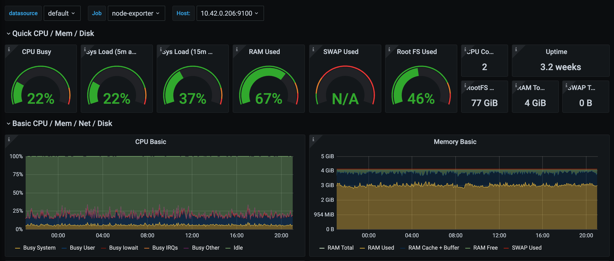

# WordPress

This is a WordPress repository configured to run on the [Kubernetes platform](https://kubernetes.io). It's a fork of Pantheon's WordPress fork modified to remove the Pantheon-specific source code. Use it as a base for a hardened WordPress installation created via Ansible using [wordpress-helm](https://codeberg.org/vhs/wordpress-helm).

Pantheon is a website platform optimized and configured to run high performance sites and then ransom those sites back to their customers when traffic rises due to popularity. This fork is intended to empower Pantheon [customers stuck with a ransom note](https://www.chicagoganghistory.com/announcements/im-back/) to self-host instead.

## Comparisons

Comparing Pantheon and Kubernetes.
### Monthly price

Pantheon is a good value when visitor count is under 25K per month. After that value quickly diminishes:

Monthly Visitors | Pantheon | Kubernetes
--- | --- | ---
25K–50K | $160† | $30‡
50K–150K | $275† | $30‡
150K–300K | $550† | Unknown
300K+ | $916† | Unknown

† Pantheon offers preferred pricing when paid annually. The charges are $114, $206, $412 and $687 respectively.

‡ Beware of monthly bandwidth limitations imposed by cloud-hosting providers such as [DigitalOcean](https://vhs.codeberg.page/go/digitalocean) and [Vultr](https://vhs.codeberg.page/go/vultr). Some providers offer unlimited bandwidth while others do not. Choosing the right one for you will depend on your specific requirements.

### Features

Comparison of features between Pantheon starter plan and wordpress-helm:

Pantheon | Kubernetes
--- | ---
Varnish | —
–  | Redis
Apache Solr | —
Nginx | Apache
PHP-FPM | PHP Redis
MySQL | MariaDB (Replicated)
PhantomJS | —
— | Ansible
WP Cron | K8s CronJob + MU Cron
WP Mail | —
Easy backups | Backups automated
Drush API | Root shell

As you can see you need to give up some things in order to migrate to Kubernetes. What you lose you gain back in the form of control. Items may be added to or removed from the stack as needed.

## Getting Started

### 1. Spin-up a free site on Pantheon

If you do not yet have a Pantheon account, you can create one for free. Once you've verified your email address, you will be able to add sites from your dashboard. Choose "WordPress" to use the upstream distribution of this fork.

### 2. Load up the site

When the spin-up process is complete, you will be redirected to the site's dashboard. Click on the link under the site's name to access the Dev environment.

### 3. Run the WordPress installer

How about the WordPress database config screen? No need to worry about database connection information as that is taken care of in the background. The only step that you need to complete is the site information and the installation process will be complete.

### 4. Wait for ransom note

Pantheon has a tendency to change their pricing model every couple of years. When you eventually get a ransom note after getting backed into a corner begin your migration to Kubernetes.

### 5. Begin migration to Kubernetes

The entire migration process should take about a week or so for an experienced developer. Full migration instructions [are available](https://vhs.codeberg.page/post/move-pantheon-wordpress-site-kubernetes/) without fee.

### 6. Profit!

